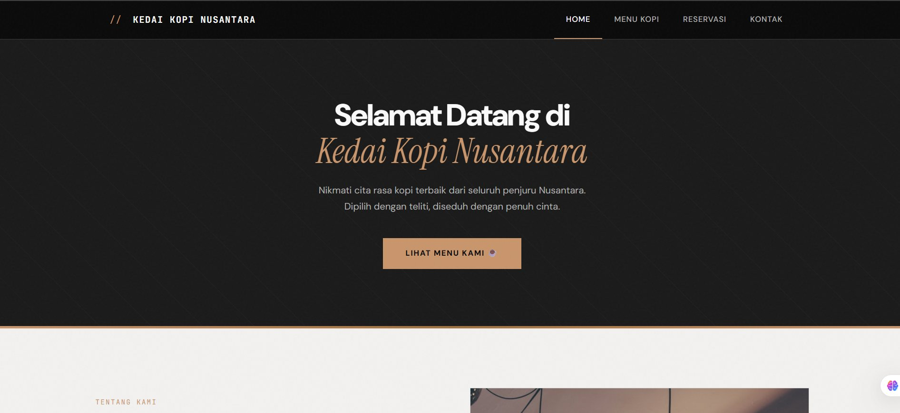
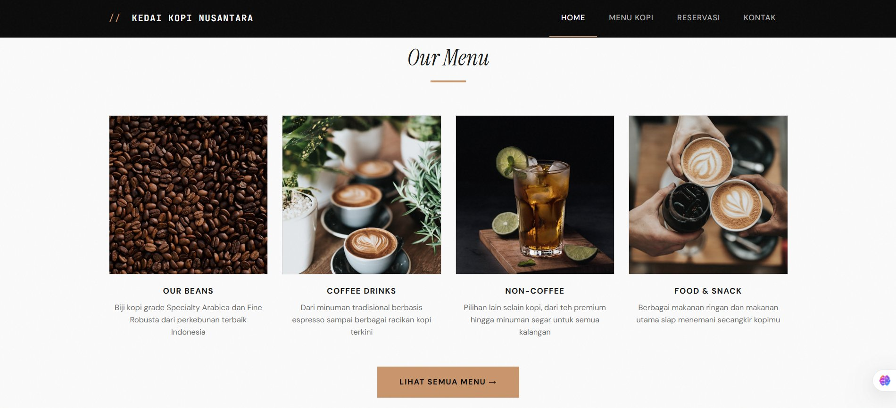
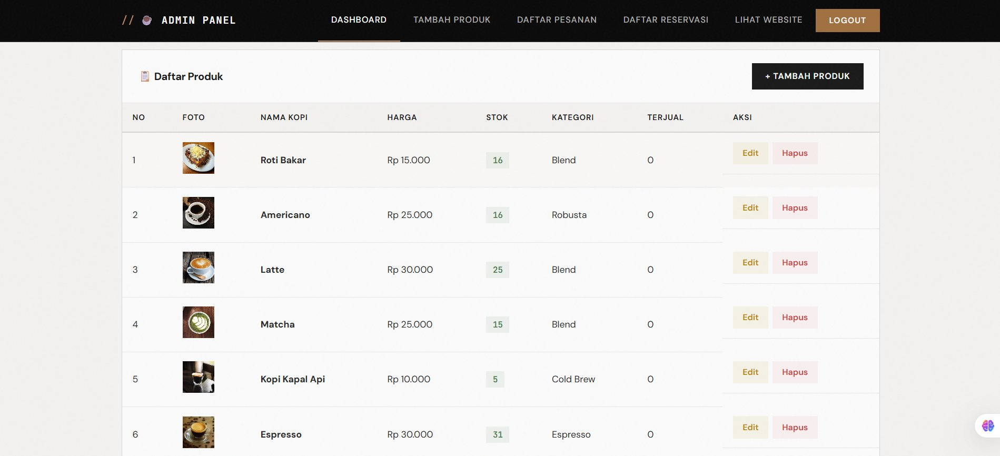
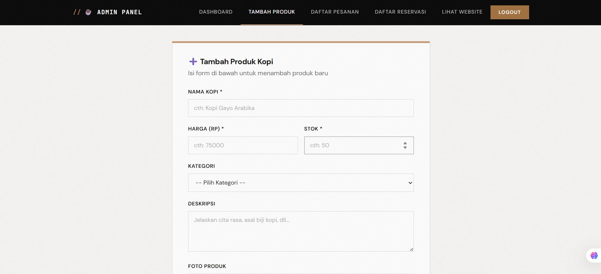
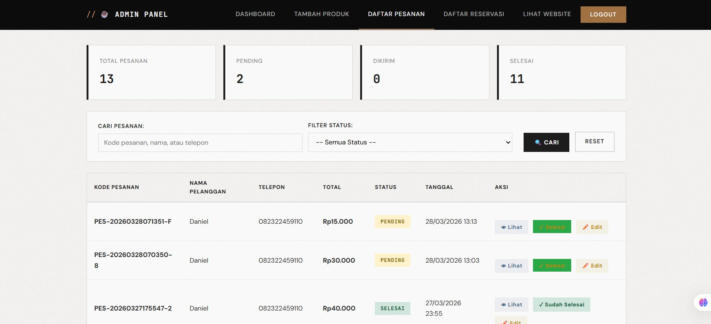

# ☕ Kedai Kopi Nusantara

> Website e-commerce kedai kopi dengan tema **Modern Industrial** — dibangun menggunakan PHP Native, MySQL, HTML/CSS/JS.



---

## 📖 Tentang Project

**Kedai Kopi Nusantara** adalah website prototype untuk sebuah kedai kopi lokal yang menyajikan kopi terbaik dari seluruh penjuru Indonesia. Website ini dibangun sebagai project web development dengan fitur lengkap mulai dari katalog produk, keranjang belanja, checkout, pembayaran QRIS (prototype), reservasi kursi, hingga admin panel.

### Design Philosophy

Website ini menggunakan aesthetic **Modern Industrial** — clean lines, monochrome palette, sharp corners, dan tipografi bold. Terinspirasi dari desain industrial coffee shop dengan sentuhan digital yang modern.

- **Color Palette**: Monochrome (hitam, charcoal, abu-abu) + aksen copper `#c8956c`
- **Typography**: DM Sans (body), JetBrains Mono (angka/kode), Instrument Serif (headline italic)
- **Style**: Sharp corners, no border-radius, grayscale image effects, noise texture overlay

---

## 🖼️ Screenshots

### Homepage


### Our Menu


### Admin Dashboard


### Tambah Produk


### Daftar Pesanan


---

## ✨ Fitur

### 🛒 Customer Side
- **Homepage** — Hero section, cerita kami, kategori menu, lokasi cabang, reservasi, gallery
- **Menu Kopi** — Katalog produk dengan kategori tag, harga, stok, tombol keranjang
- **Keranjang Belanja** — Tambah/kurang/hapus item, ringkasan pesanan
- **Checkout** — Form data pengiriman dengan validasi
- **Pembayaran QRIS** — Halaman pembayaran prototype dengan QR code dummy & countdown timer
- **Reservasi Kursi** — Pilih nomor kursi yang tersedia, form booking
- **Halaman Kontak** — Info WhatsApp, email, alamat, jam operasional, social media, Google Maps
- **Responsive Design** — Hamburger menu di mobile, layout adaptive untuk semua ukuran layar

### 🔧 Admin Panel
- **Dashboard** — Statistik produk, stok, pesanan pending, notifikasi
- **CRUD Produk** — Tambah, edit, hapus produk dengan upload foto
- **Manajemen Pesanan** — Lihat detail, update status (pending → dikirim → selesai)
- **Manajemen Reservasi** — Terima/tolak reservasi dengan catatan

---

## 🛠️ Tech Stack

| Komponen | Teknologi |
|----------|-----------|
| Backend | PHP Native (MVC-like structure) |
| Database | MySQL |
| Frontend | HTML5, CSS3, JavaScript |
| Font | Google Fonts (DM Sans, JetBrains Mono, Instrument Serif) |
| Server | Apache (XAMPP) |

---

## 📁 Struktur Folder

```
kedai-kopi/
├── admin/
│   ├── admin-navbar.php
│   ├── dashboard.php
│   ├── tambah-produk.php
│   ├── edit-produk.php
│   ├── hapus-produk.php
│   ├── daftar-pesanan.php
│   ├── lihat-pesanan.php
│   ├── edit-pesanan.php
│   ├── daftar-reservasi.php
│   ├── login.php
│   └── logout.php
├── assets/
│   ├── css/
│   │   └── style.css
│   ├── js/
│   │   └── script.js
│   └── uploads/
├── includes/
│   ├── config.php (not tracked)
│   ├── header.php
│   └── footer.php
├── index.php
├── produk.php
├── keranjang.php
├── checkout.php
├── pembayaran.php
├── pesanan-berhasil.php
├── konfirmasi-pesanan.php
├── reservasi.php
├── kontak.php
├── .gitignore
└── README.md
```

---

## 📱 Responsive

Website fully responsive dengan:
- **Hamburger menu** di mobile (slide-in dari kanan)
- **Adaptive grid** — 4 kolom → 2 kolom → 1 kolom
- **Touch-friendly** — tombol dan interaksi dioptimalkan untuk layar sentuh

---

## 📝 Catatan

- Pembayaran QRIS bersifat **prototype** — QR code dummy, tidak terhubung ke payment gateway asli
- Gambar kategori menu diambil dari [Unsplash](https://unsplash.com) (free to use)
- File `includes/config.php` tidak di-track Git untuk keamanan

---

## 👤 Author

**haafiidzzz** — [GitHub](https://github.com/haafiidzzz)

---

<p align="center">
  <sub>Built with ☕ and love</sub>
</p>
